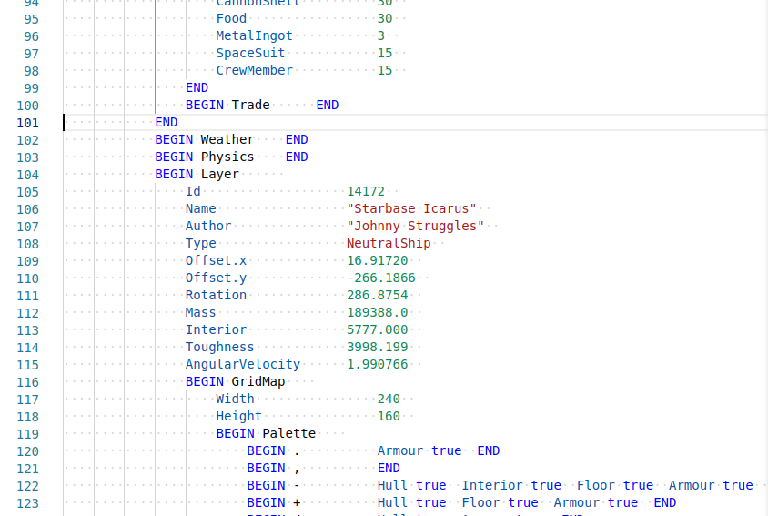

# vscode-introversion-tm-grammar README

This is an unofficial VSCode language grammar for Introversion's text-based config and save files.

## Features

Syntax colouring for save and config files from Introversion's games. Provides typical scoping of the different sections of a config or save file. It has been tested with files from [The Last Starship](https://www.introversion.co.uk/last-starship/). It should work with `.space` and `.ship` files, it should also work the the `definitions.txt` file and other config files that use this type of notation.



It should also work with the save files from Introversion's previous game [Prison Architect](https://www.paradoxinteractive.com/games/prison-architect/about) (files that have the `.prison` extension)

## Configuration

The colours should match your installed theme's colours but if you want to customise the colours you can edit your user settings json by adding rules like the following.

```json
    "editor.tokenColorCustomizations": {
        "textMateRules": [
            {
                "scope": "support.type.property-name.introversion",
                "settings": {
                    "foreground": "#0451A5"
                }
            }
        ]
    }
```

You can find the scope you want to change by moving the cursor over the section you want to inspect and using the `Developer: Inspect Editor Tokens and Scopes` command.

The name of the language in the language mode dropdown/picker is "Introversion Object Notation".
